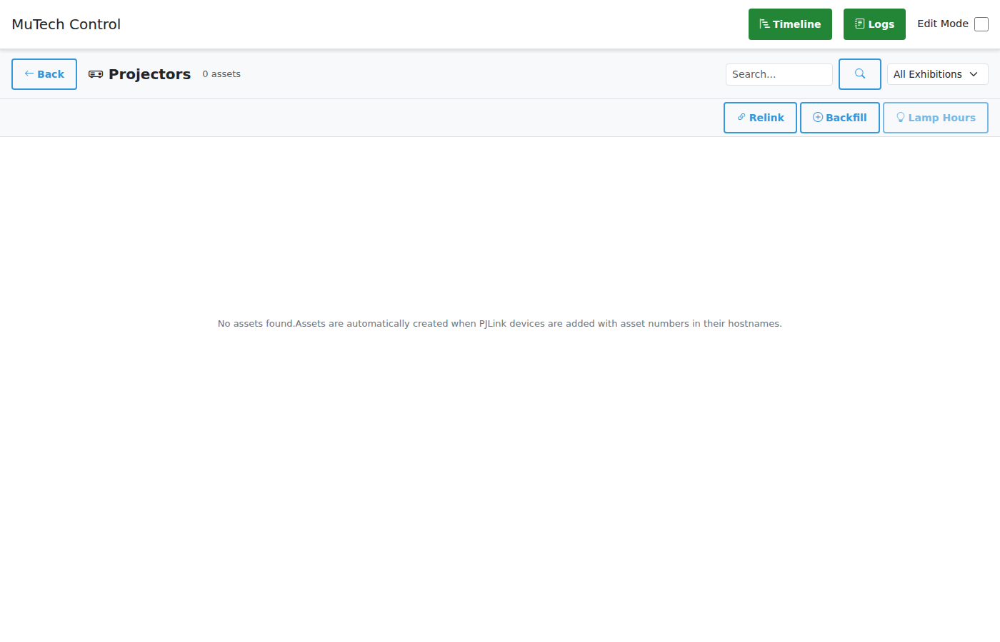

# Asset Management (Projectors)

The Asset Browser tracks projector assets and their lamp hours for maintenance planning.

## Overview

Assets represent physical projector units identified by their asset numbers. The system:
- Tracks which projector is installed where
- Logs lamp hours over time
- Maintains history even when projectors are moved between locations

## Accessing the Asset Browser

1. Enable **Edit Mode**
2. Click **Projectors** in the header



## Understanding the Interface

### Header Controls

| Control | Description |
|---------|-------------|
| **Back** | Return to main control view |
| **Search** | Filter assets by number or name |
| **All Exhibitions** | Filter assets by exhibition |

### Action Buttons

| Button | Description |
|--------|-------------|
| **Relink** | Re-run device linking for all unlinked assets |
| **Backfill** | Create missing asset records from existing PJLink devices |
| **Lamp Hours** | Record current lamp hours for selected assets |
| **Export** | Download lamp history as CSV (when assets selected) |

### Asset Table

| Column | Description |
|--------|-------------|
| **Checkbox** | Select assets for bulk operations |
| **Status** | Device state indicator (green=ON, gray=OFF, red=offline) |
| **Asset** | Asset number (e.g., "123456") |
| **Exhibition** | Current exhibition location |
| **Artwork** | Current artwork location |
| **Device** | Linked device name, or "Not linked" |
| **Lamp Hours** | Last recorded lamp hours |
| **Actions** | Edit and Delete buttons |

---

## Action Buttons Explained

### Relink

**What it does:** Attempts to link unlinked assets to PJLink devices by matching hostnames.

**When to use:**
- After adding new PJLink devices
- After changing device hostnames
- When assets show "Not linked"

**How it works:**
1. System looks for assets without a linked device
2. For each unlinked asset, searches for PJLink devices with matching asset number in hostname
3. Uses DNS to resolve hostnames and match
4. Links matching assets to devices

**Example hostname patterns:**
- `123456-projector.museum.local` → Asset 123456
- `proj-123456.local` → Asset 123456
- Pattern is configurable (see Admin Guide)

### Backfill

**What it does:** Creates new asset records from existing PJLink devices that don't have assets yet.

**When to use:**
- After importing many PJLink devices
- To ensure all projectors have asset records
- Initial system setup

**How it works:**
1. Scans all PJLink devices
2. Extracts asset numbers from hostnames
3. Creates asset records for new asset numbers
4. Links devices to newly created assets
5. Records initial lamp hours

**Results displayed:**
- `X assets linked` - Existing assets linked to devices
- `X lamp hours logged` - Initial readings recorded
- `X skipped` - Devices without asset numbers in hostname
- `X failed` - Errors during processing

### Lamp Hours

**What it does:** Records the current lamp hours from selected projectors.

**When to use:**
- Before maintenance
- Monthly/quarterly audits
- After lamp replacement (to verify reset)

**How to use:**
1. Select assets using checkboxes
2. Click **Lamp Hours** button
3. System queries each linked projector
4. Records readings with timestamp

**Note:** Only works for assets that are:
- Linked to a device
- Device is reachable (online)

### Export

**What it does:** Downloads lamp history as CSV file for selected assets.

**When to use:**
- Creating maintenance reports
- Analyzing usage patterns
- Sharing data with vendors

**CSV includes:**
- Timestamp
- Asset number
- Event type
- Lamp hours
- Delta (change)
- Exhibition/Artwork/Device at time of reading

---

## Working with Assets

### Creating Assets

Assets are created automatically when:
1. A PJLink device is added with an asset number in its hostname
2. The **Backfill** function is run

**Manual creation is not needed** - the system discovers assets from devices.

### Viewing Lamp History

Click on any asset row to expand and see the lamp hours timeline:

| Column | Description |
|--------|-------------|
| **Date** | When the reading was taken |
| **Event** | Type of event (see below) |
| **Hours** | Total lamp hours at that time |
| **+/-** | Change since previous reading |
| **Exhibition** | Exhibition at time of reading |
| **Artwork** | Artwork at time of reading |
| **Device** | Device at time of reading |

**Event Types:**
| Icon | Event | Description |
|------|-------|-------------|
| 🔌 | `onboard` | Asset linked to a new device |
| ▶️ | `power_on` | Device was turned on |
| ⏹️ | `power_off` | Device was turned off |
| 🔌 | `offboard` | Asset unlinked from device |
| ✏️ | `manual` | Manual entry by staff |

### Editing an Asset

Click the **pencil icon** on an asset row:

**Editable fields:**
- **Hostname Override** - Override auto-detected hostname
- **Notes** - Add notes about the asset (location, condition, etc.)

### Deleting an Asset

Click the **trash icon** on an asset row and confirm.

**Warning:** This deletes all lamp hours history for that asset.

---

## Asset Lifecycle

### Normal Lifecycle

```
1. PJLink device added with hostname "123456-proj.local"
   ↓
2. System extracts asset number "123456"
   ↓
3. Asset record created automatically
   ↓
4. Lamp hours recorded on power on/off events
   ↓
5. History builds over time
```

### Moving a Projector

When a projector is moved to a different location:

1. **Old device** is deleted or modified
2. Asset becomes "Not linked"
3. **New device** is added with same hostname
4. Click **Relink** to reconnect
5. History is preserved under same asset number

### Replacing a Projector

When a projector is replaced with a new unit:

1. Old projector's lamp history remains with old asset number
2. New projector gets new asset number (from its hostname)
3. Both histories are preserved separately

---

## Best Practices

### Hostname Conventions

Use consistent hostname format including asset number:
```
{asset_number}-{description}.{domain}
```

**Examples:**
- `123456-gallery1-proj.museum.local`
- `789012-auditorium.local`

### Regular Lamp Hours Recording

Schedule regular lamp hours audits:
1. Weekly or monthly, select all assets
2. Click **Lamp Hours**
3. Export CSV for records

### Before Maintenance

Before projector maintenance:
1. Record current lamp hours
2. Export history for service records
3. After lamp replacement, verify hours reset

### Monitoring Usage

Use lamp hours data to:
- Plan lamp replacements (typically 2000-5000 hours)
- Identify overused projectors
- Balance usage across multiple projectors
- Verify warranty claims

---

## Troubleshooting

### Asset Shows "Not linked"

**Causes:**
- Device was deleted
- Hostname changed
- DNS resolution failing

**Solutions:**
1. Verify device exists with correct hostname
2. Check hostname includes asset number
3. Click **Relink** to retry linking
4. Check Admin panel for DNS errors

### Lamp Hours Not Recording

**Causes:**
- Device offline
- Asset not linked
- PJLink password wrong

**Solutions:**
1. Verify device is reachable
2. Check device shows ON state
3. Verify asset is linked to device
4. Test device connection in device settings

### Wrong Lamp Hours

**Causes:**
- Projector reported wrong value
- Clock/timezone issues
- Multiple devices with same asset number

**Solutions:**
1. Manually verify projector's on-screen lamp counter
2. Add manual entry with correct value
3. Check for duplicate hostnames

### Backfill Created Wrong Assets

**Causes:**
- Hostname pattern mismatch
- Non-projector devices matched

**Solutions:**
1. Delete incorrect assets
2. Fix hostname pattern in config
3. Re-run backfill

---

## API Reference

### List Assets
```
GET /api/assets?search=123&exhibition_id=uuid
```

### Get Asset
```
GET /api/assets/{id}
```

### Update Asset
```
PUT /api/assets/{id}
{
  "hostname": "override-hostname",
  "notes": "Some notes"
}
```

### Delete Asset
```
DELETE /api/assets/{id}
```

### Record Lamp Hours
```
POST /api/assets/record-lamp-hours
["asset-id-1", "asset-id-2"]
```

### Get Lamp History
```
GET /api/assets/{id}/lamp-history
```

### Export Lamp History CSV
```
POST /api/assets/lamp-history/csv
["asset-id-1", "asset-id-2"]
```

### Backfill Assets
```
POST /api/assets/backfill
```

### Trigger Relink
```
POST /api/admin/scheduler/trigger/asset_linker
```
