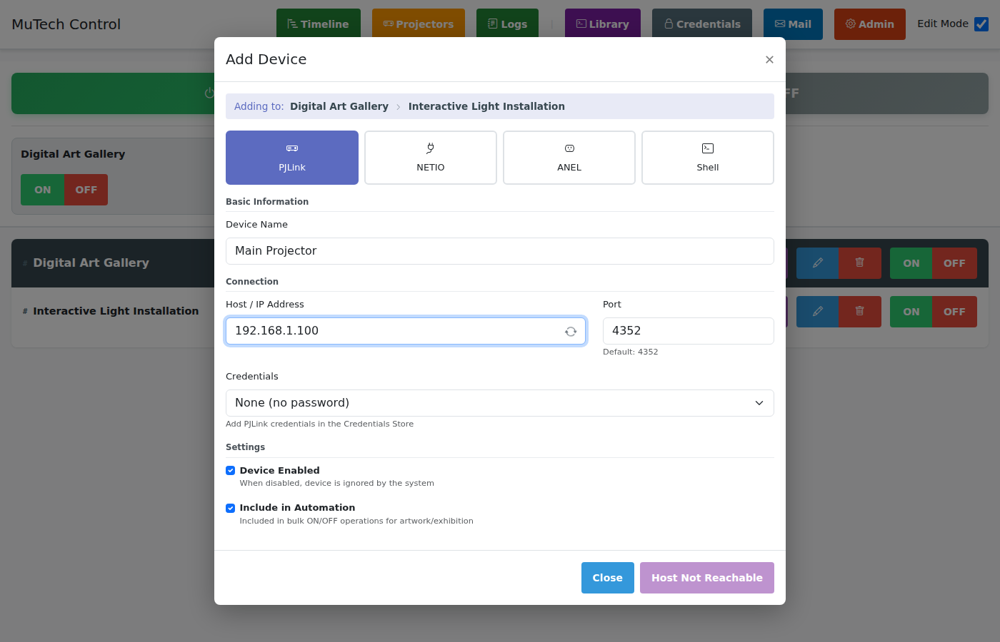
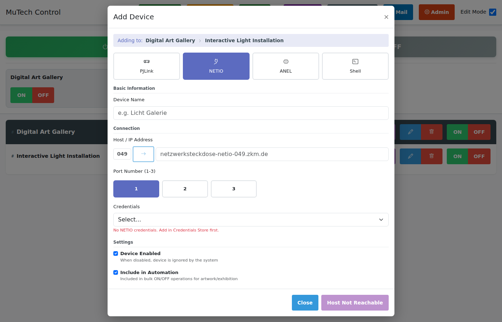
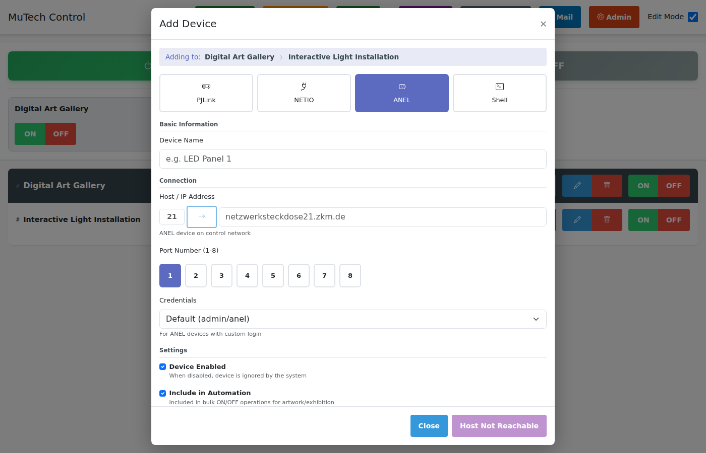
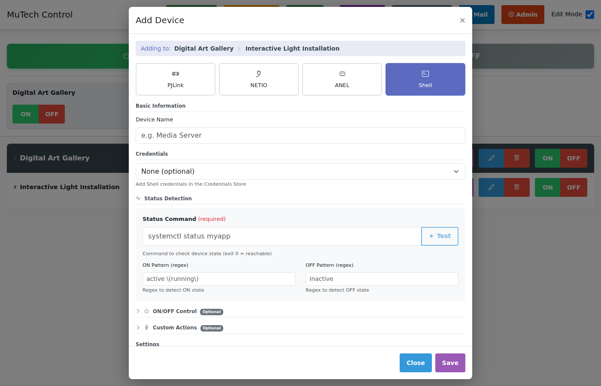

# Device Types - Detailed Guide

This document provides detailed information about each device type supported by MuTech Control.

## Overview

| Type | Protocol | Use Case |
|------|----------|----------|
| **PJLink** | TCP/4352 | Projectors (Panasonic, Epson, etc.) |
| **NETIO** | HTTP/JSON | Smart power strips |
| **ANEL** | UDP | Power distribution units |
| **Shell** | SSH/Local | Custom devices, servers, IoT |

---

## PJLink Devices

### What is PJLink?

PJLink is an industry-standard protocol for projector control, supported by most professional projectors from Panasonic, Epson, NEC, Sony, and others.

### Configuration



| Field | Required | Description |
|-------|----------|-------------|
| **Device Name** | Yes | Display name for the device |
| **Host / IP** | Yes | Projector's network address or hostname |
| **Port** | No | Default: 4352 |
| **Credentials** | No | Password for Class 2 (password-protected) projectors |
| **Device Enabled** | No | Include in state polling |
| **Include in Automation** | No | Include in bulk ON/OFF |
| **Enable Schedules** | No | Show schedule button for automated ON/OFF |
| **Route via Satellite** | No | Send commands through satellite relay (if exhibition has one assigned) |

### Features

**State Detection:**
- ON (power on, lamp running)
- OFF (standby)
- WARMING (lamp warming up, ~30 seconds)
- COOLING (lamp cooling down, ~90 seconds)

**Information Retrieved:**
- Lamp hours
- Error codes
- Input source
- Model/manufacturer

### Lamp Hours Tracking

PJLink devices automatically track lamp hours:
1. System queries lamp hours periodically
2. Hours are logged when device powers off
3. Data is linked to asset records by hostname

### Warmup/Cooldown Handling

During warmup or cooldown:
- Commands are queued, not rejected
- State shows WARMING or COOLING
- Polling increases to detect completion
- Queued commands execute when ready

### Extended Information Panel

Click on a PJLink device to expand and view detailed information:

| Field | Description |
|-------|-------------|
| **Manufacturer** | Projector manufacturer |
| **Model** | Projector model number |
| **Lamp Hours** | Current lamp usage hours |
| **MAC Address** | Network MAC address |
| **Voltage** | Current voltage reading |
| **Power** | Current power consumption |
| **Temperature** | Operating temperature |

This information is queried directly from the projector via PJLink protocol.

### Common Issues

| Problem | Solution |
|---------|----------|
| "Host Not Reachable" | Check network connectivity, verify IP |
| Wrong state reported | Check projector firmware, verify port |
| Password rejected | Add credential in Credentials Store |
| Slow response | Increase timeout in config |

---

## NETIO Devices

### What is NETIO?

NETIO produces smart power strips with per-outlet control via HTTP API. Each outlet can be controlled independently.

### Configuration



| Field | Required | Description |
|-------|----------|-------------|
| **Device Name** | Yes | Display name |
| **Host / IP** | Yes | NETIO device address |
| **Port/Outlet** | Yes | Outlet number (1-8) |
| **Credentials** | Yes | Username and password |

### Supported Models

- NETIO 4 (4 outlets)
- NETIO 4All (4 outlets + metering)
- NETIO PowerPDU 4C (4 outlets, IEC C13)
- NETIO PowerPDU 8QS (8 outlets)

### Multiple Outlets

To control multiple outlets on the same NETIO device:
1. Create one MuTech device per outlet
2. Use the same Host/IP for each
3. Specify different outlet numbers

**Example:**
- "Video Player Power" - netio-001.local, Outlet 1
- "Audio Amp Power" - netio-001.local, Outlet 2
- "Display Power" - netio-001.local, Outlet 3

### API Details

NETIO uses a JSON API:
```
GET  http://device/netio.json
POST http://device/netio.json
```

Authentication: HTTP Basic Auth

### Device Settings

NETIO devices support these additional settings:

| Setting | Description |
|---------|-------------|
| **Enable Schedules** | Show schedule button for automated ON/OFF |
| **Route via Satellite** | Send commands through satellite relay (if exhibition has one) |

---

## ANEL Devices

### What is ANEL?

ANEL produces power distribution units controlled via UDP protocol. The control is handled by a separate ANEL Runner service.

### Architecture

```
MuTech Control ──HTTP──► ANEL Runner ──UDP──► ANEL Device
```

The ANEL Runner service must be running for ANEL control.

### Configuration



| Field | Required | Description |
|-------|----------|-------------|
| **Device Name** | Yes | Display name |
| **Host / IP** | Yes | ANEL device address |
| **Port/Outlet** | Yes | Outlet number |
| **Credentials** | Yes | Device password |

### Requirements

1. ANEL Runner service must be running
2. `ANEL_RUNNER_URL` environment variable must be set
3. UDP port 75 must be accessible from ANEL Runner to device

### Troubleshooting

| Problem | Solution |
|---------|----------|
| "ANEL service unavailable" | Start ANEL Runner service |
| Commands not working | Check UDP connectivity |
| Wrong outlet controlled | Verify outlet numbering (starts at 0 or 1?) |

---

## Shell Devices

### What are Shell Devices?

Shell devices execute custom commands for any device that doesn't support standard protocols. This includes:
- Wake-on-LAN
- SSH commands
- HTTP API calls
- Local scripts
- IoT devices

### Configuration



### Status Detection

The status command determines the device's current state:

| Field | Description |
|-------|-------------|
| **Status Command** | Command to check device state |
| **ON Pattern** | Regex pattern indicating device is ON |
| **OFF Pattern** | Regex pattern indicating device is OFF |

**Example - Ping-based:**
```
Status Command: ping -c 1 -W 2 {{HOST}} && echo ONLINE || echo OFFLINE
ON Pattern: ONLINE
OFF Pattern: OFFLINE
```

**Example - SSH Service Status:**
```
Status Command: ssh {{USERNAME}}@{{HOST}} 'systemctl is-active myapp'
ON Pattern: ^active$
OFF Pattern: ^inactive$
```

### ON/OFF Control

| Field | Description |
|-------|-------------|
| **ON Command** | Command to turn device on |
| **OFF Command** | Command to turn device off |

**Example - Wake-on-LAN + SSH Shutdown:**
```
ON Command: wakeonlan aa:bb:cc:dd:ee:ff
OFF Command: ssh {{USERNAME}}@{{HOST}} 'sudo shutdown -h now'
```

### Custom Actions

Add buttons for special operations beyond ON/OFF:

| Field | Description |
|-------|-------------|
| **Action Name** | Button label |
| **Command** | Command to execute |

**Example Actions:**
- "Restart" → `ssh user@host 'sudo reboot'`
- "Set Volume 50%" → `ssh user@host 'amixer set Master 50%'`
- "Clear Cache" → `curl -X POST http://host/api/clear-cache`

### Placeholders

| Placeholder | Replaced With |
|-------------|---------------|
| `{{HOST}}` | Device hostname |
| `{{USERNAME}}` | Selected credential username |
| `{{PASSWORD}}` | Selected credential password |
| `{{CREDENTIAL:name}}` | Specific credential by name |

### Shell Library Templates

Save common configurations as templates:
1. Open **Library** in header
2. Create template with commands
3. When adding device, select template

---

## Device States

All device types use the same state model:

| State | Value | Description |
|-------|-------|-------------|
| ERROR | -1 | Device unreachable or error |
| OFF | 0 | Device is off/standby |
| ON | 1 | Device is on/running |
| COOLING | 2 | Device is cooling down (PJLink) |
| WARMING | 3 | Device is warming up (PJLink) |

### State Colors in UI

| Color | State |
|-------|-------|
| Red | ERROR |
| Gray | OFF |
| Green | ON |
| Orange | COOLING |
| Blue | WARMING |
| Yellow | Pending operation |

---

## Best Practices

### Naming Conventions

Use descriptive names that include location:
- "Gallery 1 - Main Projector"
- "Room A - Display Power (Outlet 1)"
- "Server Room - Media Server"

### Network Configuration

1. Use static IPs or reliable DNS
2. Keep devices on dedicated VLAN if possible
3. Ensure firewall allows required ports
4. Test connectivity before adding devices

### Credentials Management

1. Use the Credentials Store (don't hardcode passwords)
2. Create separate credentials per device type
3. Rotate passwords periodically
4. Use strong passwords for SSH access

### Testing New Devices

1. Add device with "Device Enabled" off
2. Use the reachability indicator to verify connection
3. Test ON/OFF manually
4. Enable device and verify polling works
5. Test bulk operations

---

## Protection Status Display

When a device belongs to an artwork with protection settings (time slices, runtime limits), an expanded device panel shows the **Protection Status**:

### Budget Bars

Visual progress bars show current usage against limits:

| Bar | Description |
|-----|-------------|
| **Daily Budget** | Runtime used today vs. daily limit |
| **Weekly Budget** | Runtime used this week vs. weekly limit |
| **Runtime Limit** | Current session runtime vs. per-run limit |
| **Cooldown** | Time remaining before device can turn on again |

### Status Indicators

| Color | Meaning |
|-------|---------|
| **Green** | Within budget, device can operate |
| **Yellow** | Approaching limit (>75% used) |
| **Red** | Budget exhausted, device blocked |
| **Blue** | In cooldown period |

### Force Completion

If a device has exceeded its runtime limit but is still on, a "Force Complete" indicator may appear. This means the system is waiting to turn off the device when safe (e.g., when cooldown period allows).

For more details, see [Artwork Protection](protection.md).
